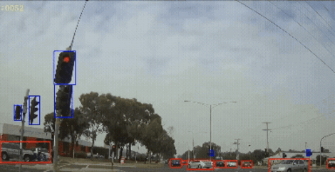

[![LinkedIn][linkedin-shield]][linkedin-url]

# Hi, I'm Josh 👋

<!-- PROJECT OVERVIEW -->
 

  <h2 align="left">I'm a Computer Vision engineer interested in the R&D of innovative AI models, and their integration into novel products </h2>

  

    - 🔭 I’m currently working on sim-to-real domain shift, and generative models using diffusion and flow matching
     
    - 🌱 MSc Robotics graduate from the University of Birmingham, UK
     
    - 😄 Hobbyist game developer
  

## Recent projects

### [Mask2Former](https://github.com/jjhenders/Mask2Former_UnityWarehouse)
* Mask2Former universal segmentation in simulated robotics environments
* Smooth fine tuning via progressively upscaled synthetic training data
  

  

 

### [DETR](https://github.com/jjhenders/DETR_bdd100k)
* Detection Transformer for dense traffic scenarios
* End to end training with bdd100k dataset with additional COCO data to address class imbalance in bdd100k
  

  

  

[linkedin-shield]: https://img.shields.io/badge/-LinkedIn-black.svg?style=for-the-badge&logo=linkedin&colorB=555
[linkedin-url]: https://www.linkedin.com/in/joshua-james-henderson/